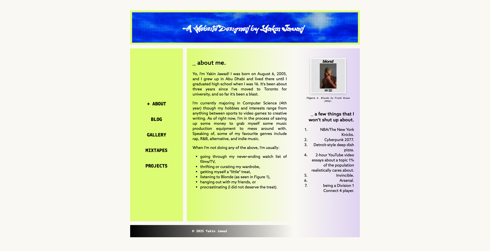

# intro

An introductory (as in, quite literally my first) attempt at making a website using HTML and CSS to the best of my abilities, essentially listing out some basic facts about myself and things I'm into. I might revisit this project in the future and update the side-bar to actually link to different sections of the webpage, but this is more-so a CSS showcase than it is HTML.

The final version of the website came out something like this:

